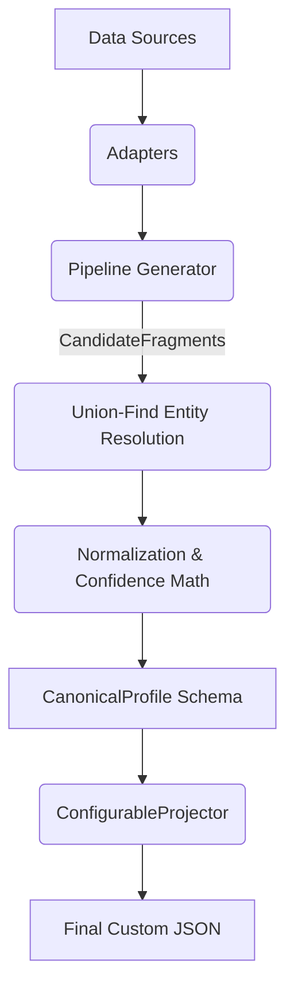

# Eightfold Multi-Source Candidate Data Transformer

> **Engineering Philosophy:** *"Honestly-empty over wrong-but-confident."* Favoring safe omission and strict penalization of dubious data rather than hallucinating or blindly accepting unverified information.

**Repository:** [https://github.com/Aayush-Bhargav/Multi-Source-Candidate-Data-Transformer](https://github.com/Aayush-Bhargav/Multi-Source-Candidate-Data-Transformer)

---

## Table of Contents
1. [Problem & Approach](#1-problem--approach)
2. [Architecture / Pipeline Stages](#2-architecture--pipeline-stages)
3. [Canonical Schema](#3-canonical-schema)
4. [Runtime Projection Config](#4-runtime-projection-config)
5. [Setup & How to Run](#5-setup--how-to-run)
6. [Source Coverage](#6-source-coverage)
7. [Edge Cases Handled](#7-edge-cases-handled)
8. [Known Limitations & Deliberately Descoped](#8-known-limitations--deliberately-descoped)
9. [Test Coverage](#9-test-coverage)
10. [Performance & Scale Notes](#10-performance--scale-notes)

---

## 1. Problem & Approach
The Candidate Data Transformer solves the highly fragmented, inconsistent, and often conflicting nature of candidate data sourced across ATS exports, CSV files, resumes, and GitHub profiles. The system ingests disparate formats and merges them into a single, deterministically resolved, high-confidence canonical profile. 

## 2. Architecture / Pipeline Stages
The pipeline executes in five strictly bounded stages:

1. **Ingestion / Streaming (`src/pipeline.py`)**: `accumulate_fragments` drives the workflow using a generator-driven pattern (`stream_fragments`) to process inputs piece-by-piece, producing standard `CandidateFragment` objects.
2. **Per-Source Extraction (`src/adapters.py`)**:
   - `csv_adapter`: Reads rows sequentially via `csv.DictReader`. Uses regex-driven fuzzy key extraction (`_fuzzy_extract`) to tolerate mangled column names.
   - `ats_json_adapter`: Leverages `ijson` for true O(1) memory overhead parsing of large JSON arrays.
   - `resume_adapter`: Fully loads PDFs via `PyMuPDF` (`fitz`), utilizing deterministic regex heuristics. Generates a synthetic ID (`id_is_synthetic=True`) from the filename.
   - `github_adapter`: Synchronous REST extraction. Implements exponential backoff, offline mock routing, and explicitly tolerates 404/403 responses.
3. **Normalization (`src/normalize.py`)**: Ensures strict domain boundaries.
   - `normalize_phone`: Uses `phonenumbers` to force E.164 formatting.
   - `normalize_country`: Uses `pycountry` to yield ISO-3166 alpha-2 codes. Pre-filters against a curated US State abbreviation dict to block collisions (e.g., `CA` = California, not Canada).
   - `normalize_date` / `normalize_year`: Enforces strict chronological sanity, rejecting end dates that precede start dates.
   - `normalize_skill`: Performs `rapidfuzz` mapping against a `skills_taxonomy.json` lexicon.
4. **Entity Resolution & Merge (`src/merge.py`)**:
   - **Union-Find Groups**: Fragments are unified cascading by `email` → `E.164 phone` → `explicit ID`.
   - **Weights**: Source trustworthiness is statically typed (ATS/CSV = 0.90, GitHub = 0.85, Resume = 0.70).
   - **Conflict Resolution**: Identical cross-source values earn a corroboration bonus (`+0.10`). Conflicts degrade to the highest-trust source, capped at a maximum confidence (`0.40`), and log to `conflict_ledger.log`.
5. **Projection & Validation (`src/project.py`)**: `ConfigurableProjector` shapes the resulting `CanonicalProfile`. It implements path resolution, normalization overrides, missing field policies, and provenance injection. It wraps output in a dynamic `pydantic.create_model` Contradiction Guard.



## 3. Canonical Schema
The output model (`src/schema.py`) is a strictly asserted `pydantic` immutable structure ensuring safe serialization:
- **Phones**: E.164 formatting (e.g., `+14155551234`) chosen for unambiguous global dialing and deduplication.
- **Location**: Explicitly nested `{city, region, country}` dictionary. Countries are ISO-3166 alpha-2 to eliminate localization drift.
- **Dates**: `YYYY-MM` or `YYYY` syntax for chronological ordering, explicitly rejecting day-level precision.
- **Skills**: Bound to the canonical taxonomy to prevent synonym fragmentation (e.g., collapsing `react.js` into `React`).

## 4. Runtime Projection Config
The JSON configuration allows downstream systems to reshape the schema dynamically without code changes.

```json
{
   "fields": [
    { "path": "name", "from": "full_name", "type": "str", "required": true },
    { "path": "primary_email", "from": "emails[0]", "type": "string", "required": true, "on_missing": "error" },
    { "path": "primary_phone", "from": "phones[0]", "type": "string", "normalize": "e164", "on_missing": "omit" },
    { "path": "technologies", "from": "skills[].name", "type": "string[]", "normalize": "canonical" }
  ],
   "include_confidence": true,
   "on_missing": "null"
}
```

## 5. Setup & How to Run

### Prerequisites
- **Python:** 3.10 or higher
- **Package Manager:** `pip` (or `conda`)
- **Git:** Installed and available in your system PATH

### Step 1: Clone the Repository
Open your terminal and run the following commands to download the project and navigate into the directory:
```bash
git clone https://github.com/Aayush-Bhargav/Multi-Source-Candidate-Data-Transformer.git
cd Multi-Source-Candidate-Data-Transformer
```

### Step 2: Environment Setup (Recommended)
It is highly recommended to use a virtual environment to isolate the project dependencies from your global Python installation.
```bash
# Create a virtual environment named 'venv'
python -m venv venv

# Activate the virtual environment
# On macOS / Linux:
source venv/bin/activate

# On Windows (Command Prompt):
venv\Scripts\activate

# On Windows (PowerShell):
.\venv\Scripts\Activate.ps1
```

### Step 3: Install Dependencies
With your virtual environment activated, install the required Python packages:
```bash
pip install -r requirements.txt
```

### Step 4: Running the Pipeline
The pipeline is executed via a Typer-based CLI. Ensure your `PYTHONPATH` is set to the root directory so local imports resolve correctly.

**Run with Default Configuration:**
Processes all sample inputs (CSV, ATS JSON, PDFs) found in the input directory and outputs to `data/output/`.
```bash
export PYTHONPATH=.
python -m src.cli --input-dir data/sample_inputs --config configs/projection.json
```

**Run with Custom Projection & GitHub Linkage:**
To link GitHub profiles to specific candidates, use the `--github-map` flag. Use `--offline` if you don't have a GitHub API token or want to use local mock JSON files.
```bash
export PYTHONPATH=.
python -m src.cli \
    --input-dir data/sample_inputs \
    --config configs/custom_projection.json \
    --github-map "carlos@example.com:octocat" \
    --offline
```
*What happens here: The pipeline loads `data/sample_inputs/github_octocat.json` and seamlessly merges the mock GitHub data with the `carlos@example.com` candidate profile.*

#### Online Mode (Live GitHub API)
To hit the live GitHub API with a real account, simply map the candidate's email to their GitHub username. The pipeline will fetch their bio, repositories, and languages in real-time and merge them into the candidate group.
```bash
export PYTHONPATH=.
python -m src.cli \
    --input-dir data/sample_inputs \
    --config configs/projection.json \
    --github-map "aayush.bhargav@iiitb.ac.in:Aayush-Bhargav"
```
*💡 Pro-Tip: If you hit GitHub's 60-request/hour anonymous rate limit, you can bypass it by generating a free Personal Access Token and exporting it before running: `export GITHUB_TOKEN="ghp_your_token_here"`.*

Outputs will be securely routed to the `data/output/` directory:
- `default_canonical_output.json` (The strict, fully-resolved Pydantic profiles)
- `projected_custom_output.json` (The reshaped JSON based on your config)
- `conflict_ledger.log` (An append-only audit log of any dropped scalar conflicts)

### Step 5: Run the Test Suite
To verify that all 50 unit and integration tests pass:
```bash
export PYTHONPATH=.
pytest -v tests/
```

---

## 6. Source Coverage
- **ATS JSON (`ats_json_adapter`)**: Supports deep arrays and isolated objects. Tolerates invalid files, null arrays, non-standard URL key embeddings. Emits safe fragments on error.
- **CSV (`csv_adapter`)**: Tolerates out-of-order columns, extraneous columns, and regex-variant headers (e.g. `Candidate Name` vs `full_name`).
- **Resumes (`resume_adapter`)**: Relies on basic structural block headings (e.g. `Experience`, `Education`) and standard regex extractions. Tolerates empty text parses and unreadable PDFs without crashing.
- **GitHub (`github_adapter`)**: Synchronous REST calls fetching `user` and `repos`. Explicitly handles `404 Not Found` and `403 Rate Limit` responses safely.

## 7. Edge Cases Handled
- **Missing/Garbage Source Files**: Process safely bypassed via `_failed_fragment`.
- **Fuzzy Column Variants**: Resolves disjointed CSV/JSON formats using `_fuzzy_extract` logic.
- **URL Normalization for Link Dedup**: Strips `https://`, `www.`, and trailing slashes for semantic equity grouping in `_norm_url`.
- **US State vs. Country Code Collisions**: `normalize_country` checks a predefined 50-state dict specifically blocking elements like `IN` or `CA` from hallucinating countries.
- **Conflicting Cross-Source Values**: `_resolve_scalar` logs divergences and correctly downgrades confidence math to a hard limit (`_CONFLICT_CAP`).
- **Chronologically Inverted Dates**: Invalid date ranges (e.g. end date precedes start date) trigger chronological penalties `_CHRONO_P` (0.15) in `_norm_exp`.
- **Overlapping Multi-Source Experience**: `_dedup_exp` calculates overlapping `datetime` sweep-line intersections and merges boundaries while correctly maintaining both sources in the `_src` string.
- **Skill Taxonomy Fuzzy-Matches**: A fuzzy mapping below `87` aborts to return the original term, whereas matching `87-99` registers a `-0.10` penalty in `normalize_skill`.
- **Identical Resume Filenames**: Same-name PDF files generate synthetic IDs and require standard cascade matching instead of automatically collapsing into a single user.

## 8. Known Limitations & Deliberately Descoped
- **GitHub Association Isolation**: GitHub fragments rarely expose public emails or phones. Without explicit `--github-map` hinting via the CLI, they will deterministically isolate into single-fragment profiles rather than aggressively guessing associations by name.
- **Single-Process Constraint**: The pipeline operates synchronously. There is no parallel processing implemented for adapter throughput.
- **Scale Choke-point**: While ATS inputs stream in O(1) memory, the `_group_fragments` union-find phase groups all `CandidateFragment` objects into RAM sequentially. An extremely large dataset (e.g. millions of rows) will exceed memory.
- **Regex Limitations**: The `resume_adapter` avoids non-deterministic LLMs in favor of regex scanning; consequently, wildly unconventional resume designs (multi-column tables without logical line-breaks) result in unstructured `raw_lines` text dumps.
- **State Ephemerality**: There is no database or persistent ledger beyond `.json` file outputs. Merging across multiple independent pipeline executions is unsupported.

## 9. Test Coverage
The test suite enforces 100% adherence to domain logic:
- `test_adapters.py`: Source ingestion logic, fuzzy fallback maps, canonical nested parsing.
- `test_merge.py`: Resolution rules, correct overlapping date aggregations, populated-only math validations, synthetic ID safety checks.
- `test_normalize.py`: Base normalizer behaviors.
- `test_normalizers.py`: Edge case behaviors (US states collisions, chrono limits, E.164 behaviors).
- `test_pipeline.py`: Generator iteration and orchestration execution.
- `test_projector.py`: Dynamic `create_model` contradiction guards, Five Directives behaviors.
- `test_schema.py`: Strict schema invariant immutability bounds.
- `test_integration.py`: End-to-end full batch suite against dummy JSON/CSV files.

**Verified Pass Count:** 50/50 Passed.

## 10. Performance & Scale Notes
The pipeline makes strong architectural concessions to memory over speed.
- Using `ijson` over `json.load()` for `ats_json_adapter` guarantees streaming evaluation, mitigating bulk memory load for multi-GB ATS extracts.
- Utilizing iterators through the `stream_fragments` function enforces an O(1) ingestion pass limit.
- However, as noted in the limitations, the in-memory array `frag_dicts` constructed for `_group_fragments` scales at `O(n)` candidates, bounding system scale tightly to available RAM strictly at the merging step. Furthermore, `PyMuPDF` instantiates full PDF payloads into memory on a per-file basis prior to textual extraction.
