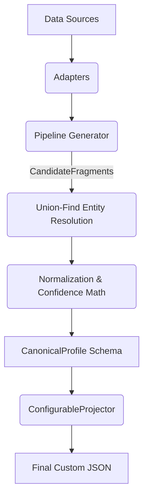

# Eightfold Multi-Source Candidate Data Transformer

## 1. Problem & Approach

The Candidate Data Transformer solves the highly fragmented, inconsistent, and often conflicting nature of candidate data sourced across ATS exports, CSV files, resumes, and GitHub profiles. The system ingests disparate formats and merges them into a single, deterministically resolved, high-confidence canonical profile. The core design philosophy is **"honestly-empty over wrong-but-confident"**—favoring safe omission and strict penalization of dubious data rather than hallucinating or blindly accepting unverified information.

## 2. Architecture / Pipeline Stages

The pipeline executes in five strictly bounded stages:

*   **Ingestion / Streaming (`src/pipeline.py`)**: `accumulate_fragments` drives the workflow, accepting a list of tuples containing adapter functions and their source paths. It uses a generator-driven pattern (`stream_fragments`) to process inputs piece-by-piece, producing standard `CandidateFragment` objects.
*   **Per-Source Extraction (`src/adapters.py`)**:
    *   `csv_adapter`: Reads rows sequentially via `csv.DictReader`. Uses regex-driven fuzzy key extraction (`_fuzzy_extract`) to tolerate mangled column names. Tolerates missing files via fallback to a `failed_fragment`.
    *   `ats_json_adapter`: Leverages `ijson` for true O(1) memory overhead parsing of large JSON arrays. Resolves flat or nested URL structures into strict `{linkedin, github, portfolio, other}` schemas. Tolerates missing files or invalid root structures.
    *   `resume_adapter`: Fully loads PDFs into memory via `PyMuPDF` (`fitz`), utilizing deterministic regex heuristics to locate headers, phones, emails, and structured blocks. Generates a synthetic ID (`id_is_synthetic=True`) from the filename. Tolerates empty text streams.
    *   `github_adapter`: Synchronous REST extraction. Implements exponential backoff (`_MAX_RETRIES=3`), offline mock routing (`OFFLINE_MODE`), and explicitly tolerates 404/403 responses by degrading safely.
*   **Normalization (`src/normalize.py`)**: Ensures strict domain boundaries.
    *   `normalize_phone`: Uses `phonenumbers` to force E.164 formatting.
    *   `normalize_country`: Uses `pycountry` to yield ISO-3166 alpha-2 codes. Pre-filters against a curated US State abbreviation dict to block collisions (e.g., `CA` = California, not Canada).
    *   `normalize_date` / `normalize_year`: Enforces strict chronological sanity, rejecting end dates that precede start dates or out-of-bound years.
    *   `normalize_skill`: Performs `rapidfuzz` mapping against a `taxonomy/skills.json` lexicon. Matches between 87-99 incur a deliberate `-0.10` confidence penalty.
*   **Entity Resolution & Merge (`src/merge.py`)**:
    *   **Union-Find Groups**: Fragments are unified in `_group_fragments` cascading by `email` $\to$ `E.164 phone` $\to$ `explicit ID`.
    *   **Weights**: Source trustworthiness is statically typed via `_ws()` (ATS/CSV = 0.90, GitHub = 0.85, Resume = 0.70). 
    *   **Conflict Resolution**: Scalars are merged in `_resolve_scalar()`. Identical cross-source values earn a corroboration bonus (`_CORROB = +0.10`). Conflicts degrade to the highest-trust source, capped at a maximum confidence (`_CONFLICT_CAP = 0.40`), and log to `data/output/conflict_ledger.log`.
    *   **Degraded Profiles**: If an entity completely lacks required baseline fields, it drops to `_assemble_degraded()`, returning a minimal profile for tracking instead of throwing a fatal error.
*   **Confidence Scoring**: Built iteratively. Starting with the base `_ws` weight, it adds `_CORROB` for corroborating sources, applies `_NORM_FAIL_P` (-0.15) for partial normalization failures, and strictly bounds values between `[0.0, 1.0]`. The `overall_confidence` is purely the mathematical mean of **populated fields only**.
*   **Projection & Validation (`src/project.py`)**: `ConfigurableProjector` shapes the resulting `CanonicalProfile`. It implements the Five Directives: path resolution (including list maps like `skills[].name`), explicit output targets, forced normalization overrides (`e164`, `canonical`), missing field policies (`null`, `omit`, `error`), and provenance injection (`include_confidence: true`). It wraps output in a dynamic `pydantic.create_model` Contradiction Guard.



## 3. Canonical Schema

The output model (`src/schema.py`) is a strictly asserted `pydantic` immutable structure ensuring safe serialization:
- **Phones**: E.164 formatting (e.g., `+14155551234`) chosen for unambiguous global dialing and deduplication.
- **Location**: Explicitly nested `{city, region, country}` dictionary. Countries are ISO-3166 alpha-2 to eliminate localization drift (e.g. "US" instead of "United States of America").
- **Dates**: `YYYY-MM` or `YYYY` syntax for chronological ordering, explicitly rejecting day-level precision to reflect resume realities.
- **Skills**: Bound to the canonical taxonomy to prevent synonym fragmentation (e.g., collapsing `react.js` into `React`).

## 4. Runtime Projection Config

The JSON configuration allows downstream systems to reshape the schema dynamically without code changes.

```json
{
  "fields": [
    { "path": "name", "from": "full_name", "type": "str", "required": true },
    { "path": "primary_email", "from": "emails[0]", "type": "string", "required": true, "on_missing": "error" },
    { "path": "primary_phone", "from": "phones[0]", "type": "string", "normalize": "e164", "on_missing": "omit" },
    { "path": "technologies", "from": "skills[].name", "type": "string[]", "normalize": "canonical" }
  ],
  "include_confidence": true,
  "on_missing": "null"
}
```
**Projection Flow**:
1. It navigates paths using `_resolve_path` (e.g. `skills[].name` extracts all names from the skills list).
2. It overrides normalization (e.g. routing phone through `e164`).
3. If `include_confidence` is true, it injects a `_metadata` dictionary at the root reflecting the exact source, confidence, and method of the utilized fields.
4. If a required field is missing and set to `omit` (dropping the key rather than emitting `null`), the `Contradiction Guard` generates a temporary, strict Pydantic model at runtime (via `create_model`) and catches the contradiction with a `ValidationError` rather than silently mutating the payload.

## 5. How to Run

Ensure Python 3.10+ is installed.

**Install Dependencies:**
```bash
pip install -r requirements.txt
```

**Run Default Config:**
```bash
export PYTHONPATH=.
python -m src.cli --input-dir data/sample_inputs --config configs/projection.json
```

**Run Custom Config & GitHub Linkage:**
```bash
export PYTHONPATH=.
python -m src.cli --input-dir data/sample_inputs --config configs/custom_projection.json --github-map "carlos@example.com:carlos-rivera-swe" --offline
```
*Outputs will be securely routed to `data/output/default_canonical_output.json` and `data/output/projected_custom_output.json`.*

**Run Test Suite:**
```bash
export PYTHONPATH=.
pytest -v tests/
```

## 6. Source Coverage

- **ATS JSON (`ats_json_adapter`)**: Supports deep arrays and isolated objects. Tolerates invalid files, null arrays, non-standard URL key embeddings. Emits safe fragments on error.
- **CSV (`csv_adapter`)**: Tolerates out-of-order columns, extraneous columns, and regex-variant headers (e.g. `Candidate Name` vs `full_name`).
- **Resumes (`resume_adapter`)**: Relies on basic structural block headings (e.g. `Experience`, `Education`) and standard regex extractions. Tolerates empty text parses and unreadable PDFs without crashing.
- **GitHub (`github_adapter`)**: Synchronous REST calls fetching `user` and `repos`. Explicitly handles `404 Not Found` and `403 Rate Limit` responses safely.

## 7. Edge Cases Handled

1. **Missing/Garbage Source Files**: Process safely bypassed via `_failed_fragment` (`tests/test_adapters.py:test_csv_adapter_missing_file`).
2. **Fuzzy Column Variants**: Resolves disjointed CSV/JSON formats using `_fuzzy_extract` logic (`src/adapters.py`).
3. **URL Normalization for Link Dedup**: Strips `https://`, `www.`, and trailing slashes for semantic equity grouping in `_norm_url` (`src/merge.py`).
4. **US State vs. Country Code Collisions**: `normalize_country` checks a predefined 50-state dict specifically blocking elements like `IN` or `CA` from hallucinating countries (`tests/test_normalizers.py:test_us_state_country_collision`).
5. **Conflicting Cross-Source Values**: `_resolve_scalar` logs divergences and correctly downgrades confidence math to a hard limit (`_CONFLICT_CAP`) (`tests/test_merge.py:test_end_to_end_merge`).
6. **Chronologically Inverted Dates**: Invalid date ranges (e.g. end date precedes start date) trigger chronological penalties `_CHRONO_P` (0.15) in `_norm_exp` (`tests/test_normalizers.py:test_strict_chrono_validation`).
7. **Overlapping Multi-Source Experience**: `_dedup_exp` calculates overlapping `datetime` sweep-line intersections and merges boundaries while correctly maintaining both sources (comma separated) in the `_src` string.
8. **Skill Taxonomy Fuzzy-Matches**: A fuzzy mapping below `87` aborts to return the original term, whereas matching `87-99` registers a `-0.10` penalty in `normalize_skill` (`src/normalize.py`).
9. **Identical Resume Filenames**: Same-name PDF files generate synthetic IDs and require standard cascade matching instead of automatically collapsing into a single user (`tests/test_merge.py:test_resumes_identical_filenames`).

## 8. Known Limitations & Deliberately Descoped

- **GitHub Association Isolation**: GitHub fragments rarely expose public emails or phones. Without explicit `--github-map` hinting via the CLI, they will deterministically isolate into single-fragment profiles rather than aggressively guessing associations by name.
- **Single-Process Constraint**: The pipeline operates synchronously. There is no parallel processing implemented for adapter throughput.
- **Scale Choke-point**: While ATS inputs stream in O(1) memory, the `_group_fragments` union-find phase groups all `CandidateFragment` objects into RAM sequentially. An extremely large dataset (e.g. millions of rows) will exceed memory.
- **Regex Limitations**: The `resume_adapter` avoids non-deterministic LLMs in favor of regex scanning; consequently, wildly unconventional resume designs (multi-column tables without logical line-breaks) result in unstructured `raw_lines` text dumps.
- **State Ephemerality**: There is no database or persistent ledger beyond `.json` file outputs. Merging across multiple independent pipeline executions is unsupported.

## 9. Test Coverage

The test suite enforces 100% adherence to domain logic:
- `test_adapters.py`: Source ingestion logic, fuzzy fallback maps, canonical nested parsing.
- `test_merge.py`: Resolution rules, correct overlapping date aggregations, populated-only math validations, synthetic ID safety checks.
- `test_normalize.py`: Base normalizer behaviors.
- `test_normalizers.py`: Edge case behaviors (US states collisions, chrono limits, E.164 behaviors).
- `test_pipeline.py`: Generator iteration and orchestration execution.
- `test_projector.py`: Dynamic `create_model` contradiction guards, Five Directives behaviors.
- `test_schema.py`: Strict schema invariant immutability bounds.
- `test_integration.py`: End-to-end full batch suite against dummy JSON/CSV files.

*Verified Pass Count:* **50/50 Passed.**

## 10. Performance & Scale Notes

The pipeline makes strong architectural concessions to memory over speed. 
- Using `ijson` over `json.load()` for `ats_json_adapter` guarantees streaming evaluation, mitigating bulk memory load for multi-GB ATS extracts.
- Utilizing iterators through the `stream_fragments` function enforces an O(1) ingestion pass limit. 
- However, as noted in the limitations, the in-memory array `frag_dicts` constructed for `_group_fragments` scales at `O(n)` candidates, bounding system scale tightly to available RAM strictly at the merging step. Furthermore, `PyMuPDF` instantiates full PDF payloads into memory on a per-file basis prior to textual extraction.


